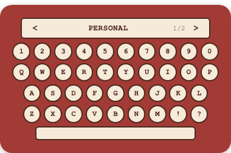
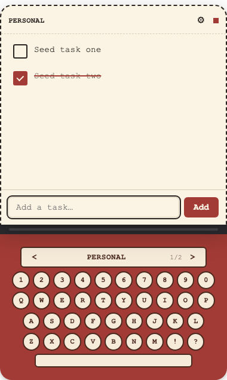
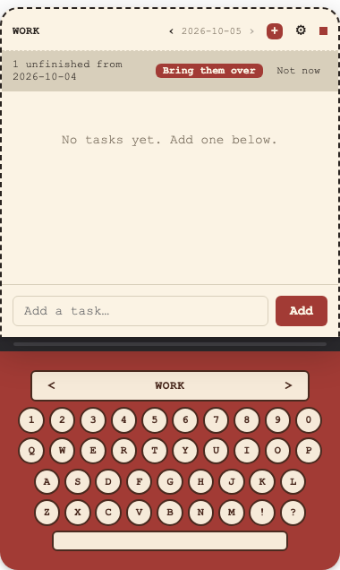

# Typewriter

A tiny desktop todo widget shaped like a typewriter. Click the keys and a paper
sheet slides up with your tasks. Your tasks are plain Markdown files, so they
work with Obsidian. No account, no cloud, no network.

  
  

## Install

Download the latest file from [Releases](../../releases).

**Mac (Apple Silicon):** open the `.dmg`, drag Typewriter to Applications. The
first time, right-click the app and choose **Open**.

**Linux (x86_64):** download the `.AppImage`, then
`chmod +x Typewriter*.AppImage && ./Typewriter*.AppImage`. No root needed.

## Use

1. Click the keyboard to open the sheet.
2. Type a list name such as `Personal` and pick a folder. Typewriter creates
   `<folder>/Personal/` with today's note.
3. Add more lists with the gear (⚙). Switch lists with the `<` `>` arrows on
   the typewriter.
4. Press the red `+` to start a note for today.

Press `+` on a new day and Typewriter offers to bring over yesterday's
unfinished tasks. Nothing is created or copied unless you ask.

## Your data

Each list is a folder of `YYYY-MM-DD.md` notes. The app only stores where the
folders are. Remove a list in the gear menu and your notes stay.

## Build it yourself

The source code lives on the [`develop` branch](https://github.com/nipunarora8/Typewriter/tree/develop). See [docs/DEVELOPMENT.md](https://github.com/nipunarora8/Typewriter/blob/develop/docs/DEVELOPMENT.md).

## Idea Credits

[Tina Huang](https://www.youtube.com/@TinaHuang1)
